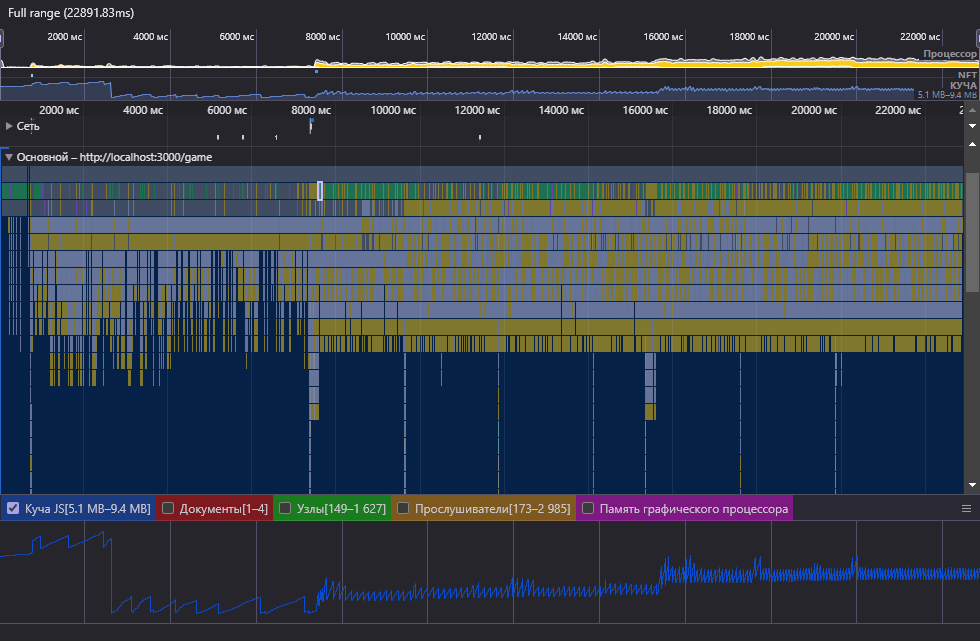
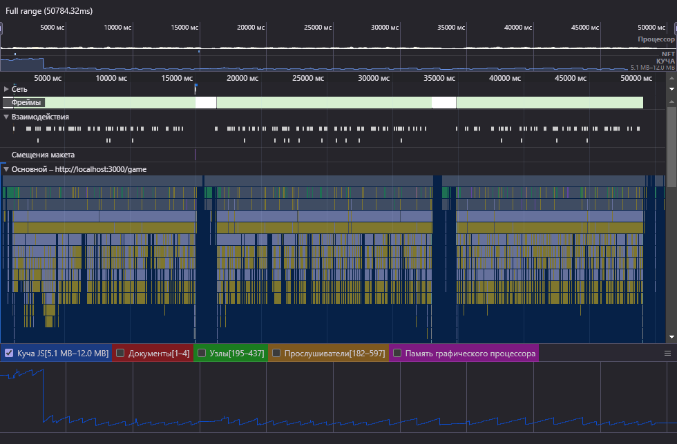

## Отчет об утечках памяти в приложении

### Приложение (без запуска игры)

#### Проход по приложению. Действия:
* Прокрутка страницы (Главная)
* Возврат наверх по нажатию кнопки
* Переход на следующую страницу в навигационной панели (Лидерборд)
* Наведение на колонки с информацией для отображения иконки сортировки
* Нажатие на иконку сортировку для изменения её состояния
* Переход к следующей странице (Игра)
* Переход к следующей странице (Форум)
* Прокрутка страницы
* Переход к конкретной теме форума по клику
* Прокрутка страницы
* Возврат по кнопке "Назад" в навигационной панели
* Открытие секции "Создание новой темы" по клику на раздел в навигационной панели
* Возврат по кнопке "Назад" в навигационной панели
* Переход к следующей странице (Профиль)
* Нажатие на кнопку "Изменить" для раблокировки формы профиля
* Нажатие на кнопку "Отменить" для блокировки формы
* Открытие секции "Изменить пароль" по клику на раздел в навигационной панели
* Клик по любому полю с появлением валидационной ошибки об обязательности поля
* Открытие секции "Выход" по клику на раздел в навигационной панели
* Переход на главную страницу по клику в навигационной панели
* Переключение темы "Светлая" -> "Тёмная" по клику в навигационной панели
* Переключение темы "Тёмная" -> "Светлая" по клику в навигационной панели
* Остановка записи профиля производительности
   
#### Общий профиль производительности:

* Время выполнения теста: **56.49 сек**
* Выделенная память: **5.8 Мб** - **13.8 Мб**
* Хранимые документы: **1** - **5**
* Хранимые узлы: **188** - **1379**
* Хранимые прослушиватели: **182** - **468**

#### График используемой памяти

**Описание графиков**: Приведенные выше графики показывают, что система постепенно выделяет ресурсы приложению (график растёт) с небольшими очистками (короткие скачки вниз). После чего запускается Garbage Collector производя полное высвобождение накопившихся ресурсов (резкое падение графика до минимума).

**Промежуточный итог**: _Исходя из описания графиков можно сделать вывод, что в приложении отсутствуют утечки памяти. Все занимаемые приложением ресурсы успешно высвобождаются сборщиком мусора._

### Игра

#### Выполнение действий:
* Запуск игры по клику на кнопку на странице "Игра"
* Прыжки по платформам вверх с помощью клавиши "Пробел" на клавиатуре
* Имитация проигрыша для триггера функций окончания игры
* Перезапуск игры по нажатию на кнопку "Рестарт"
* Несколько прыжков вверх и имитация проигрыша с окончанием игры
* Перезапуск игры по нажатию на кнопку "Рестарт"
* Несколько прыжков вверх и имитация проигрыша с окончанием игры
* Остановка записи профиля производительности

#### Профиль производительности

* Время выполнения теста: **22.89 сек**
* Выделенная память: **5.1 Мб** - **9.4 Мб**
* Хранимые документы: **1** - **4**
* Хранимые узлы: **149** - **1627**
* Хранимые прослушиватели: **173** - **2985**

**Описание графика кучи JS**: На данном графике представлен профиль производительности процесса игры. На нём можно видеть, что выделенные ресурсы через какое-то время полностью высвобождаются сборщиком мусора (резкое падение графика). Продолжаются циклы выделения/высвобождения памяти (прямой пилообразный график без тенденции роста). После перезапуска игры система выделяет дополнительные ресурсы без освобождения текущих (скачок графика вверх). Циклы выделения/высвобождения ресурсов ускоряются (небольшие скачки роста и падения стали короче по оси X). После второго перезапуска игры выделяется дополнительный объем ресурсов без высвобождения текущих (скачок графика). Циклы выделения/высвобождения ускоряются еще сильнее.

**Описание дополнительных сведений**: Для полноты картины обратимся к графику нагрузки процессора (самый верхний график заполненный желтым цветом) и графику выполнения задач (центральный график). На графиках видно как в момент перезапуска игры (скачок выделения памяти) нагрузка на процессор увеличивается и практически не падает. После второго перезапуска ситуация повторяется. Также мы видим повышение плотности задач в центральном графике (сокращаются/исчезают интервалы между вызовами) после первого и второго перезапусков.

**Промежуточный итог**: _Исходя из данной информации можно сделать вывод, что в игровом движке присутствует значительная утечка памяти._

#### Причины:
После остановки игры игровой движок не полностью очищает информацию об используемых объектах. `RequestAnimationFrame` продолжает свою работу даже после вызова функции `cancelAnimationFrame`. Затем при перезапуске запускает новый `requestAnimationFrame`, вследствие чего запрашиваются дополнительные ресурсы системы, циклы становятся короче, возрастает нагрузка на процессор. То же происходит после второго перезапуска (запускается третий requestAnimationFrame с неотмененными предыдущими). Отдельно стоит отметить, что визуально в игре это тоже заметно за счёт увеличивающейся скорости анимации спрайтов персонажа.

#### Решение:
Добавлен метод `cleanup`, который вызывается в методе `finishGame` и полностью очищает информацию об объектах, полученных на этапе инициализации игры. Таким образом даем понять браузеру, что данные объекты можно не хранить в памяти.

#### Профиль производительности после решения проблемы

* Время выполнения теста: **50.78 сек**
* Выделенная память: **5.1 Мб** - **12.0 Мб**
* Хранимые документы: **1** - **4**
* Хранимые узлы: **195** - **437**
* Хранимые прослушиватели: **182** - **597**

**Описание графиков**: На данном графике можно увидеть значительную разницу в использовании памяти, ресурсов процессора, а также распределения задач по таймлайну. В начале происходит высвобождение памяти выделенной после перезагрузки страницы, затем ровный пилообразный график (циклы выделения/высвобождения ресурсов) без тенденции роста. Ту же ситуацию видно на графиках нагрузки процессора и выполнения задач. На центральном графике хорошо видны перезапуски игры и равномерное распределение задач после них. Увеличивающая плотность теперь может зависеть только от частоты события клавиши "Пробел" на клавиатуре. Также можно заметить значительное снижение количества хранимых узлов и прослушивателей.

### Итоги: 
Во время проведения описанных экспериментов были найдены утечки памяти и повышенная нагрузка на процессор в процессе игры. В остальной части приложения утечки обнаружены не были. Проблема была решена, в чем можно убедиться изучив представленные графики.
