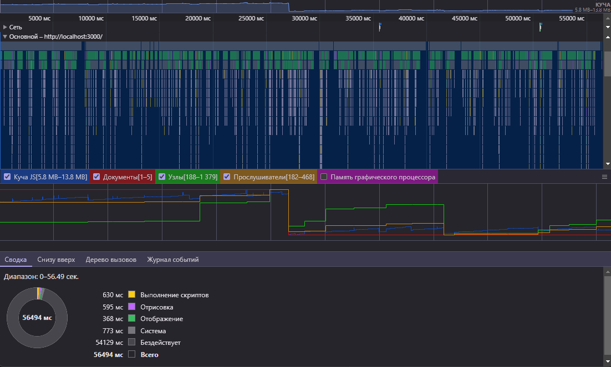
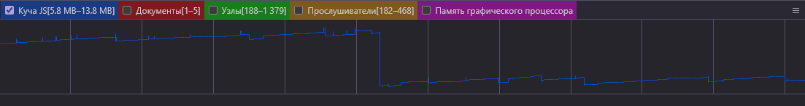

## Отчет об утечках памяти в приложении

### Приложение (без запуска игры)

#### Проход по приложению. Действия:
* Включение записи профиля производительности с чекбоксом "Memory"
* Прокрутка страницы (Главная)
* Возврат наверх по нажатию кнопки
* Переход на следующую страницу в навигационной панели (Лидерборд)
* Наведение на колонки с информацией для отображения иконки сортировки
* Нажатие на иконку сортировку для изменения её состояния
* Переход к следующей странице (Игра)
* Переход к следующей странице (Форум)
* Прокрутка страницы
* Переход к конкретной теме форума по клику
* Прокрутка страницы
* Возврат по кнопке "Назад" в навигационной панели
* Открытие секции "Создание новой темы" по клику на раздел в навигационной панели
* Возврат по кнопке "Назад" в навигационной панели
* Переход к следующей странице (Профиль)
* Нажатие на кнопку "Изменить" для раблокировки формы профиля
* Нажатие на кнопку "Отменить" для блокировки формы
* Открытие секции "Изменить пароль" по клику на раздел в навигационной панели
* Клик по любому полю с появлением валидационной ошибки об обязательности поля
* Открытие секции "Выход" по клику на раздел в навигационной панели
* Переход на главную страницу по клику в навигационной панели
* Переключение темы "Светлая" -> "Тёмная" по клику в навигационной панели
* Переключение темы "Тёмная" -> "Светлая" по клику в навигационной панели
* Остановка записи профиля производительности
   
#### Общий профиль производительности:

* Время выполнения теста: **56.49 сек**
* Выделенная память: **5.8 Мб** - **13.8 Мб**
* Хранимые документы: **1** - **5**
* Хранимые узлы: **188** - **1379**
* Хранимые прослушиватели: **182** - **468**

#### График используемой памяти

**Описание графиков**: Приведенные выше графики показывают, что система постепенно выделяет ресурсы приложению (график растёт) с небольшими очистками (короткие скачки вниз). После чего запускается Garbage Collector производя полное высвобождение накопившихся ресурсов (резкое падение графика до минимума).

**Промежуточный итог**: Исходя из описания графиков можно сделать вывод, что в приложении отсутствуют утечки памяти. Все занимаемые приложением ресурсы успешно высвобождаются сборщиком мусора.
